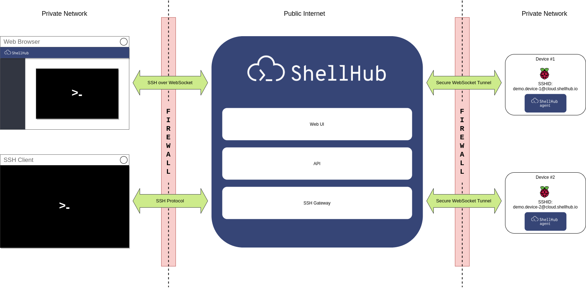

# Introduction

This introduction section is intended to give a high-level overview of the ShellHub.

The ShellHub is composed of two major parts, the **SSH Gateway** and the **Device Agent**.
These parts work together to provide a secure SSH connection across the network
to Linux-based devices.

## Architecture

## Basic concepts

There are few basic concepts that are important to understand the ShellHub.
Those basic concepts are detailed below:

### SSH Gateway

The ShellHub SSH gateway is a modern SSH server built using the microservices
design pattern, meaning that multiple small, isolated services make up the server.
It must be installed on any cloud provider like Azure, Google, AWS or DigitalOcean.

### Device Agent

The ShellHub device agent which must be installed on the device.

This guide is for those looking for a deeper understanding of ShellHub.

### SSHID

SSHID is a unique address to identify a device in ShellHub SSH gateway.

SSHID consist of following format:

    <NAMESPACE>.<DEVICE_NAME>@<GATEWAY_ADDRESS>

Where:

1. `<NAMESPACE>`: the account namespace identifier
2. `<DEVICE_NAME>`: the device name identifier
3. `<GATEWAY_ADDRESS>`: the gateway address identifier

Example of SSHID: `lab.rasp-1@localhost`
